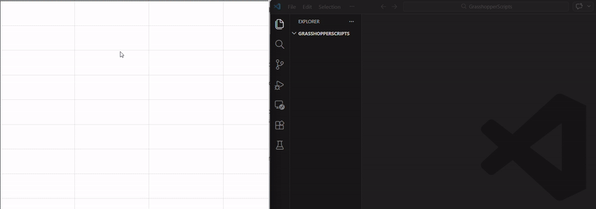

ScriptParasite
==============

Two-way sync between Grasshopper script components and external editors. Edit your scripts in VS Code, Visual Studio, Rider, Pycharm instead of the built-in Grasshopper editor.

When enabled, the script parasite component watches the C# component it’s grouped with, and writes the changes to the file [Nickname].cs in the selected folder. By default this is the folder “GrasshopperScripts” in my documents.

### Installation
- Install using the Rhino 8 package manager `PackageManager`, pick `ScriptParasite 2`

### How it works

When enabled, ScriptParasite watches the script component it's grouped with. It writes the script content to `[Nickname].cs` or `[Nickname].py` in the output folder (default: `My Documents\GrasshopperScripts`). The last used folder is remembered.

Changes sync both ways: edits in Grasshopper are written to disk, and edits saved in your editor are loaded back into Grasshopper.

### Getting started

- Add the script component to the canvas.
- Drag from the top to connect to the C# script.
- Set enabled to true
- Head over to your My Documents\GrasshopperScripts
- With Visual Studio Code: Open the folder.
- With Visual Studio Community or Rider, open the GrasshopperScripts.csproj file.
- That’s it!

### What gets synced

- Added parameters (input/output)
- Changed parameter names (input/output)
- Changed parameter types and list types (input)
- Code changes

### Supported editors

| Editor                 | C# | Python | Notes                                                                  |
|------------------------|----|--------|------------------------------------------------------------------------|
| **Visual Studio Code** | ✓  | ✓      | Auto-configured via `.csproj` and `.vscode/settings.json` |
| **Visual Studio**      | ✓  |        | Open the `.csproj` file                                                |
| **JetBrains Rider**    | ✓  |        | Open the `.csproj` file for C#                                         |
| **JetBrains PyCharm**  |   | ✓      | [Requires manual configuration](Grasshopper/README.PythonConfiguration.md)                                          |

### Grasshopper for Mac
This plugin is reported to have been working for mac.

### Version history
- 2026-03-07, Version 2.1.0: Added project support for python and C#. 
- 2025-09-25: Version 2.0.0: Major update: compatiblity with Rhino 8, dropped backwards compatiblity with Rhino 6/7. Now possible to use python components as well.
- 2021-08-18, Version 1.1.0: Fixed whitespace issues, line numbers are now matching the line numbers in the editor. Solved Visual Studio and Visual Studio Code problems, improved robustness. Dropped Rhino 5 / grasshopper 0.9.x support.
- 2018-12-21, Version 1.0.0: Initial release

#### Support
For support regarding this plugin, please do not use the comments below, but use the grasshopper and rhino forum at discourse.mcneel.com with the tag scriptparasite.

For bugs, please use the github issue tracker

#### Credits
- [Andrew Heumann], [Anton Kerezov], [Zac Zhang] for kindly contributing code improvements

#### Contact
For any issues, kindly ask on the discourse forum of McNeel, or open an issue on github.

[Andrew Heumann]:https://github.com/andrewheumann
[Anton Kerezov]:[https://github.com/dilomo]
[Zac Zhang]:[https://github.com/ZacZhangzhuo]

### Source code / Licence / Contributing
The plugin is open source (MIT Licence) and available on Github. If you have suggestions or improvements, open an issue/pull request on github, and I'll get back to you.
